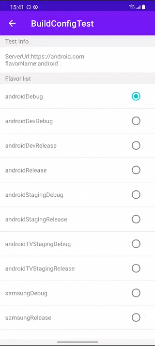

## Readme

> A Gradle plugin helps to proxy all the BuildConfig fields in the Android project.

### Background

In android BuildConfig, We might have different configurations to initial some components like network server url. We
However, This requires us to assemble different packages and usually is not a problem, But if we do not have the ability
to assemble the package, this is a problem. So here, we might want to change the BuildConfig programmatically without
changing the build settings.

### How to use it

1. Initial the Gradle plugin: buildconfig and apply the plugin: 'build-config-delegate'

2. Initial the BuildConfig configurations.

```
override fun attachBaseContext(newBase: Context?) {
    super.attachBaseContext(newBase)
    //Initial all the build config configurations.
    BuildConfigDelegate.initialModuleBuildConfig(newBase)
}
```

3. Change the build flavor programmatically

```
# Get all the flavors.
Set<String> flavorSet = BuildConfigDelegate.getFlavorSet()
BuildConfigDelegate.setCurrentFlavor(flavor)
```

More details.

```
override fun onItemStateChanged(key: Long, selected: Boolean) {
    super.onItemStateChanged(key, selected)
    if (selected) {
        //Current flavor
        val flavor = buildFlavorAdapter[key.toInt()]
        BuildConfigDelegate.setCurrentFlavor(flavor)
        //Initial the text again and check the value.
        binding.textBuildConfig.text = "ServerUrl:${BuildConfig.SERVER_URL}\n" +
                "FlavorName:${BuildConfig.FLAVOR_NAME}"
    }
}
```

Here is the picture about change the build flavor.



### How it works

1. First We add gradle task for each of the build flavor e.g., androidDev in group: buildconfig

```
collectAndroidDevDebugBuildConfig
collectAndroidDevReleaseBuildConfig

generateAndroidDevDebugBuildConfigDelegate
generateAndroidDevReleaseBuildConfigDelegate
```

2. Add metadata to the original build fields.

```
SERVER_URL=http://www.server.com-> `BuildConfig#(app/library)http://www.server.com`
```

3. Generate a delegate class for the BuildConfig.

```
private static final String SERVER_URL = Build.SERVER_URL -> 
private static final String SERVER_URL = BuildConfigDelegate.getString("app/library/...","SERVER_URL","default value")


private static final String TEST_TEXT = "This is server:"+Build.SERVER_URL+" and this is the token:"+Build.ACCESS_TOKEN; ->
private static final String TEST_TEXT = new StringBuilder().append("This is server:")
                            .append(BuildConfigDelegate.getString("library","SERVER_URL","default value")
                            .append(" and this is the token:")
                            .append(BuildConfigDelegate.getString("library","ACCESS_TOKEN","default value").toString()
```

So we can handle all the custom BuildConfig fields.

4. Manage all the BuildConfig fields in runtime.

```
//All the BuildConfig fields. The key means the module name, the value means the all the BuildConfig fields.
public static final Map<String, List<ClassField>> getFlavorClassFields() {
    return buildConfigDelegate.flavorClassFields;
}
//The current build flavor. 
public static final String getCurrentFlavor() {
    return buildConfigDelegate.currentFlavor;
}
//The initial package build flavor.
public static final String getPackageFlavor() {
    return buildConfigDelegate.packageFlavor;
}

//All the build flavors
public static final Set<String> getFlavorSet() {
    return buildConfigDelegate.flavorSet;
}
//Change the current flavor programmatically.
public static final void setCurrentFlavor(String flavor) {
    buildConfigDelegate.currentFlavor = flavor;
}
```


